**学习资源**：
1、关键词：parallel beam CT reconstruction（平行束CT重建）
2、《医学图像重建入门》曾更生
3、Youtube视频资源：https://www.youtube.com/watch?v=ZgcD4C-4u0Q

**大致思路**：对于给定的图像 ，先使用拉东变换（radon）获得各个方向上的投影，再通过反投影，并辅以滤波等手段，对图像进行重建。

**选用图像**：本次我将以该图像为素材展开实验。该图像为512x512的3通道RGB图片

<div align="center"></div>


## 一、读取图片并转为单通道

```matlab
pic = imread("panda.png");  % 读取图片
pic = rgb2gray(pic);    % 将图片改为单通道的黑白图片
imshow(pic,[]);	

>> size(pic);
	  ans = 512 512
```

<div align="center">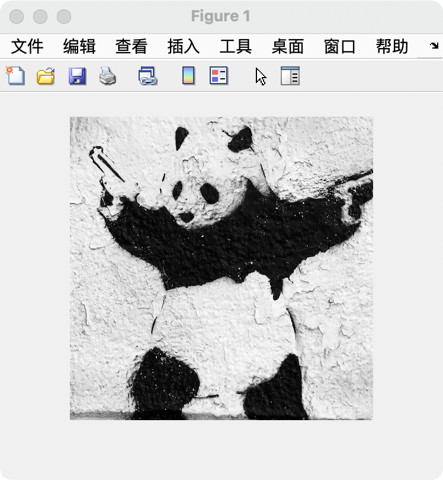</div>

可以看到图片已经成功被读取，且已经转化为单通道图片。


## 二、投影——拉东变换（radon）

### 1、 radon变换的理论

这里我们采用matlab自带的radon函数对图像进行投影。radon变换的基本原理是沿着投影方向对图像进行**线积分**，其被积函数 $f(x,y)$ 是像素的灰度值。公式如下：
$$
\begin{align}
g(\rho,\theta) &=\int^{\infty}_{-\infty}f_{\theta}(\rho,t)dt\\ 
& =\int^{\infty}_{-\infty}\int^{\infty}_{-\infty}f(x,y)\cdot\delta(\rho-x\cos \theta-y\sin \theta)dxdy
\end{align}
$$

其中，**$\delta$ 函数**是一个广义函数，它没有具体定义。$\delta$ 函数在非零的点取值均为0，而在整个定义域的积分为1。同时，在研究图像时，一条直线的解析式通常被描述为 $\rho = x\cos\theta+y\sin \theta$。

在这里，$\delta$ 函数限制了线积分沿着直线$\rho = x\cos\theta+y\sin \theta$进行。
$$
\delta(\rho-x\cos \theta-y\sin \theta)=
\begin{cases}
0,& \rho\neq x\cos \theta+y\sin \theta\\
1,& \rho=x\cos \theta+y\sin \theta
\end{cases}
$$

<div align="center">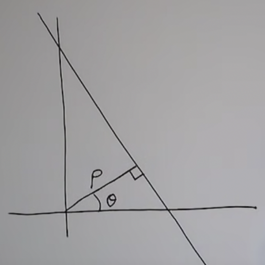</div>

### 2、radon变换效果

例如，分别从0度和90度两个角度做投影：

````matlab
>> plot(radon(pic, 0))   % 0度投影
>> figure
>> plot(radon(pic, 90))  % 90度投影
````

<div align="center">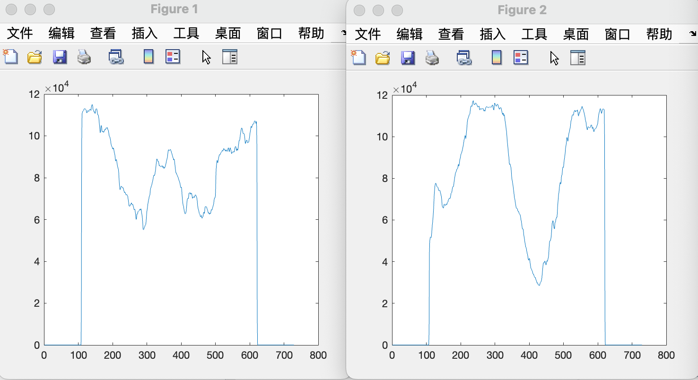</div>


## 三、直接反投影

可以使用`iradon(pic, theta)`将radon变换所得的各个角度的投影简单地反向叠加，重建原图像。

### 1、90度  直接反投影

```matlab
>> theta = 0:90:179
theta =  
			0   90
>> proj = radon(pic, theta);
>> imshow(iradon(proj, theta, 'none'),[])； % none表示“不采用任何滤波器”
```

<div align="center">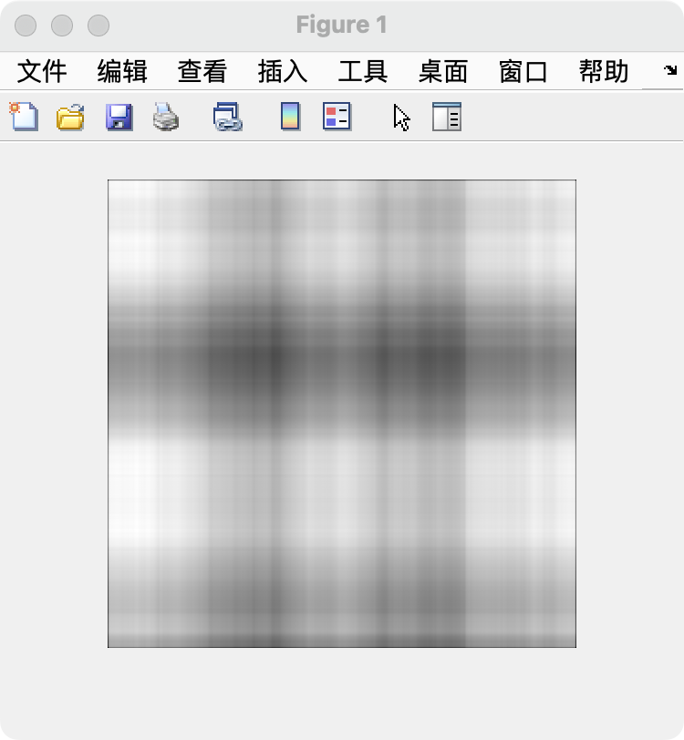</div>

### 2、60度  直接反投影

```matlab
>> theta = 0:60:179
theta =
     0    60   120
>> proj = radon(pic, theta);
>> imshow(iradon(proj, theta, 'none'),[])；	% none表示“不采用任何滤波器”
```

可以看到，随着角度增幅的减少、数量的增多，图像正逐渐勾勒出形状。

<div align="center">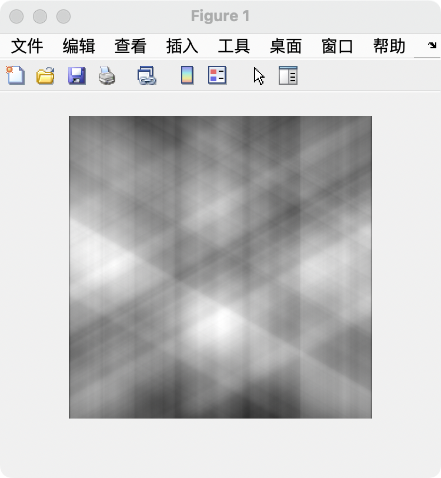</div>


### 3、30度  直接反投影

```matlab
>> theta = 0:30:179
theta =
     0    30    60    90   120   150
>> proj = radon(pic, theta);
>> imshow(iradon(proj, theta, 'none'),[])；	% none表示“不采用任何滤波器”
```

已经能隐约看出来熊猫的轮廓了。

<div align="center">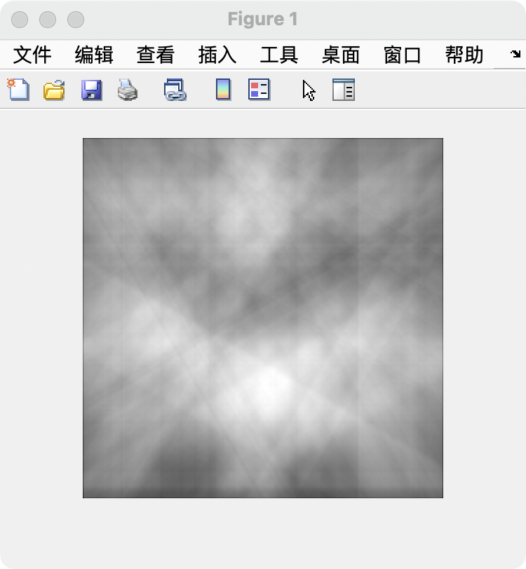</div>

### 4、1度（全角度）  直接反投影

```matlab
>> theta = 0:179
>> proj = radon(pic, theta);
>> imshow(iradon(proj, theta, 'none'),[])；	% none表示“不采用任何滤波器”
```

已经可以较为清晰地重建出原图像了。

<div align="center">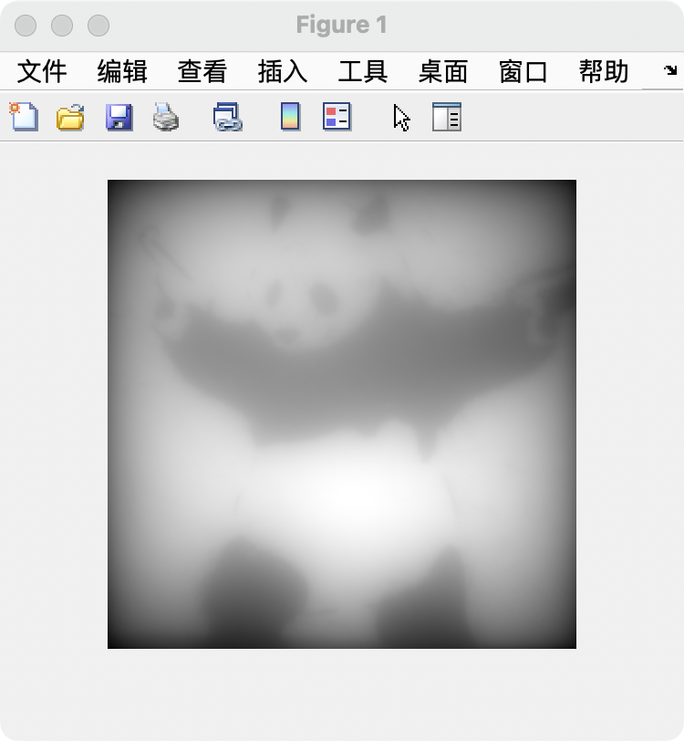</div>

### 5、缺陷

使用iradon通过直接反投影的方式，虽然可以较为清晰地重建原图像，但是仍存在<font color="red">模糊、伪影</font>等问题，不利于医学诊断。


## 四、傅里叶中心切片定理

又名“投影切片定理”。通过傅里叶变换，将图像从**空间域**转到**频率域**，可以观察出图像的更多特点。

### 1、内容

**二维图像的中心切片定理**：二维函数 $f(x,y)$ 投影 $g(\rho,\theta)$ 的一维傅里叶变换 $G(\omega,\theta)$ **等于** 函数 $f(x,y)$ 的二维傅里叶变换 $F(\omega_x,\omega_y)$ 沿与探测器平行的方向过原点的片段。

<div align="center"></div>

### 2、公式推导

$$
\begin{align}
G(\omega,\theta)&=\int^{\infty}_{-\infty}g(\rho,\theta)e^{-2\pi j\omega\rho}d\rho\\

&=\int^{\infty}_{-\infty}[\int^{\infty}_{-\infty}\int^{\infty}_{-\infty}I(x,y)\cdot\delta(\rho-x\cos \theta-y\sin \theta)dxdy]e^{-2\pi j \omega\rho}d\rho\\

&=\int^{\infty}_{-\infty}\int^{\infty}_{-\infty}I(x,y)[\int^{\infty}_{-\infty}\delta(\rho-x\cos \theta-y\sin \theta)e^{-2\pi j\omega\rho}d\rho ]dxdy\\

&=\int^{\infty}_{-\infty}\int^{\infty}_{-\infty}I(x,y)e^{-2\pi j\omega(x\cos\theta+y\sin\theta)}dxdy\\

&=\int^{\infty}_{-\infty}\int^{\infty}_{-\infty}I(x,y)e^{-2\pi j(ux+vy)}dxdy（其中u=\omega\cos \theta,v=\omega \sin \theta）\\

&=图像的二维傅里叶变换中，过原点、方向相同的片段
\end{align}
$$

### 3、分析“简单反投影”效果不佳的原因

从二维视角来看，简单地将中心切片通过反投影的方式堆叠起来，会存在**中心区域（原点附近）被过度采样**的问题，这就导致了成像结果的不准确，从而引发了一系列的不佳效果。

<div align="center">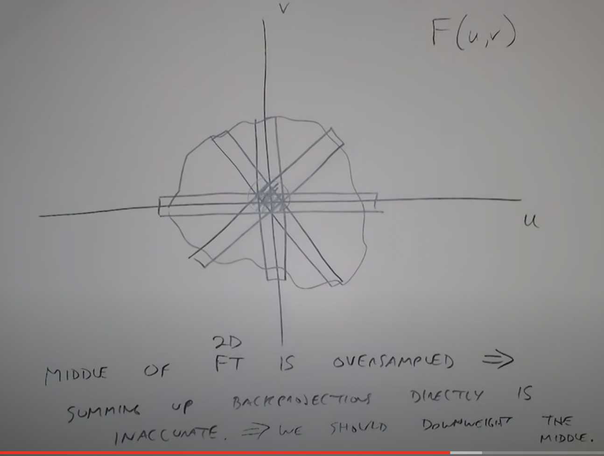</div>


## 五、先滤波后反投影（FBP）算法

### 1、算法思想

把投影数据 $g(\rho,\theta)$ 的一维傅里叶变换 $G(\omega,\theta)$ 乘以 $|\omega|$ 。然后，再对乘积 $|\omega|G(\omega,\theta)$做**一维傅里叶逆变换**。最后，再做反投影，这样就得到了重建的图像。

### 2、公式推导

通过公式推导，观察如何通过傅里叶反变换方法，将 $F(\omega_x,\omega_y)$ 转换为原图像 $I(x,y)$：
$$
\begin{align}
I(x,y) & =\int_{-\infty}^{\infty}\int_{-\infty}^{\infty}F(u,v)e^{2\pi j(ux+vy)}dudv\\

& =\int_{0}^{2\pi}\int_{-\infty}^{\infty} \omega F(\omega \cos \theta,\omega \sin \theta)e^{2\pi j(x\cos \theta+y \sin \theta)\omega} d\omega d\theta，（这里改换极坐标系）\\

& =\int_{0}^{2\pi}\int_{-\infty}^{\infty} \omega G(\omega,\theta)e^{2\pi j(x\cos \theta+y \sin \theta)\omega} d\omega d\theta\\

& =\int_{0}^{\pi}\int_{-\infty}^{\infty} |\omega|G(\omega,\theta)e^{2\pi j(x\cos \theta+y \sin \theta)\omega} d\omega d\theta\\

& =\int_{0}^{\pi}[\int_{-\infty}^{\infty} |\omega|G(\omega,\theta)e^{2\pi j\omega \rho} d\omega |_{\rho=x\cos \theta+y\sin \theta}] d\theta

\end{align}
$$
而内层积分 $\int_{-\infty}^{\infty} |\omega|G(\omega,\theta)e^{2\pi j\omega \rho} d\omega $ 就是 $G(\omega,\theta)$ 乘以**斜坡滤波器** $|\omega|$，再进行**逆**傅里叶变换所得的结果。

综上所述，通过该算法，可以完整还原出原图像 $I(x,y)$。

### 3、==算法流程==

**Step1：**计算每个投影的一维傅里叶变换结果 $G(\omega, \theta_k)$。

**Step2：**将$G(\omega,\theta_k)$乘以斜坡滤波器。

**Step3：**对Step2的结果做一维傅里叶逆变换。

**Step4：**将所有处理后的结果叠加，最终得到原图像。

### 4、matlab简易实现

参考matlab文档，发现 `iradon`函数的完整定义中有 filter 这个选项：

```matlab
I = iradon(R,theta,interp,filter,frequency_scaling,output_size)
```

进一步查阅文档，发现了matlab提供了几种不同的滤波器。其中，`None`表示不选用滤波器，否则默认选用`Ram-Lak`这个滤波器；其余的滤波器都是在`Ram-Lak`滤波器的基础上再乘以一个调和函数。

<div align="center">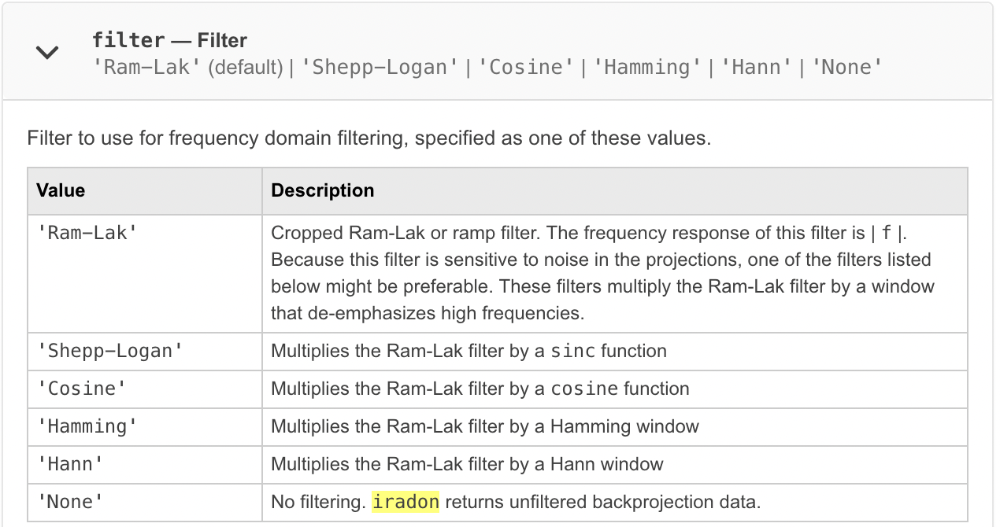</div>

下面测试一下不使用滤波器和使用`Ram-Lak`滤波器的区别：

```matlab
clear;
close all;
% 读取图片，并将图片改为单通道
pic = imread("panda.png"); 
pic = rgb2gray(pic);  
% 投影——radon变换
theta = 0:179;
proj = radon(pic, theta);
figure;
imshow(iradon(proj, theta, 'none'), []);	% none  不使用滤波器
figure;
imshow(iradon(proj, theta),[]);		% 默认使用Ram-Lak滤波器
```

效果如下，左图没有使用滤波器，右图使用了`Ram-Lak`滤波器。效果还是比较明显的：

<div align="center">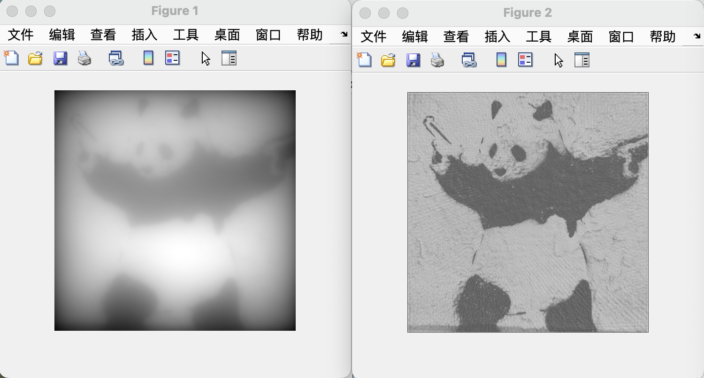</div>


## 六、手动实现FBP算法

### **Step1：**计算每个投影的一维傅里叶变换结果 $G(\omega, \theta_k)$。

```matlab
% ==== step1:计算每个投影的一维傅里叶变换G(w,theta) ==== %
I = imread("panda.png");
I = rgb2gray(I);    % 转为灰度图片

g = radon(I,0:179);   % 做0~179度共计180个角度的投影 
width = length(g); 

G = fft(g, width);   % 一维快速傅里叶变换。注意：该结果为复数
```

查看滤波前，投影的效果` imshow(g, []), title("投影")`：

<div align="center">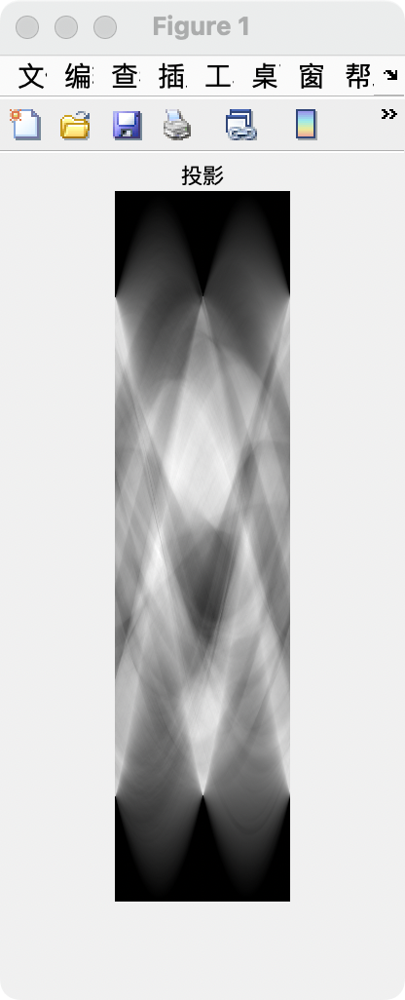</div>

### **Step2：**将$G(\omega,\theta_k)$乘以斜坡滤波器。

参考iradon，我们这里也使用**Ram-Lak滤波器**。

```matlab
% ==== step2:将G(w,theta)乘以斜坡滤波器|w| ==== %
% 这里采用Ram-Lak滤波器
filter = 2*[0:round(width/2-1), width/2:-1:1]' / width;
G_filtered = G .* filter;     % 滤波：用一维傅里叶变换结果点乘filter
```

查看一下`Ram-Lak`滤波器的形状：

<div align="center">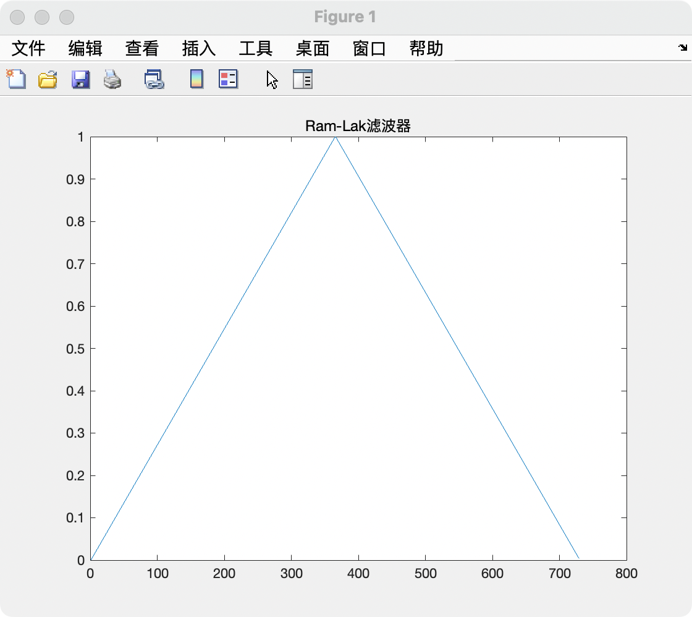</div>

使用`plot`查看`Ram-Lak`滤波器的效果，可以看到`G_filtered`明显比`G`更均匀：

<div align="center">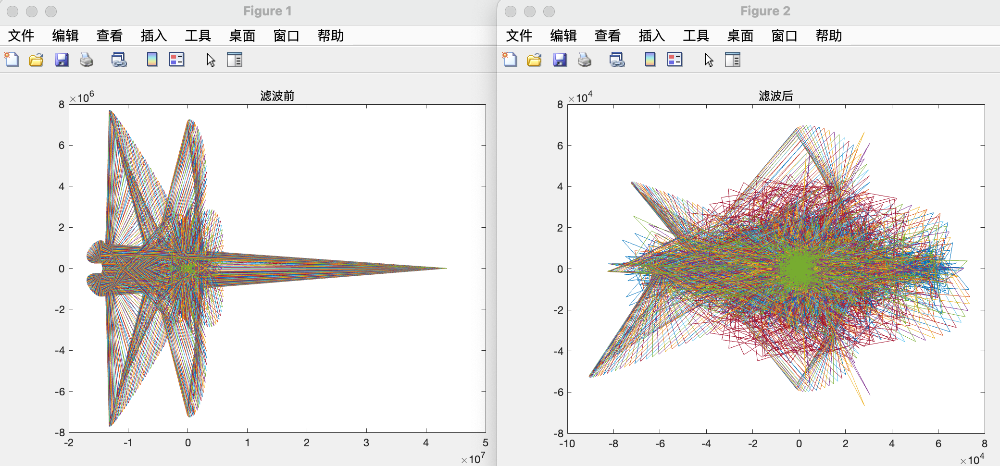</div>

### **Step3：**对Step2的结果做一维傅里叶逆变换。

```matlab
% ==== step3:对step2的结果做一维傅里叶逆变换 ==== %
g_filtered = ifft(G_filtered);
```

查看滤波后的投影效果`figure,imshow(g_filtered), title("滤波后的投影")`，发现报警告。

<div align="center">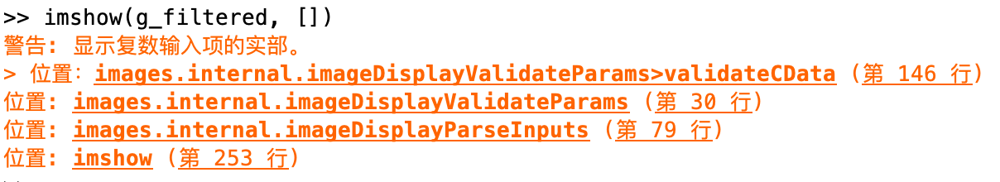</div>

查询资料，发现fft是基于复数实现的，查阅别人做法，只取实部。修改代码：

```matlab
% ==== step3:对step2的结果做一维傅里叶逆变换 ==== %
g_filtered = ifft(G_filtered);
g_filtered = real(g_filtered);	% 取实部
```

查看效果，果然滤波后比滤波前的投影要均匀许多：

<div align="center">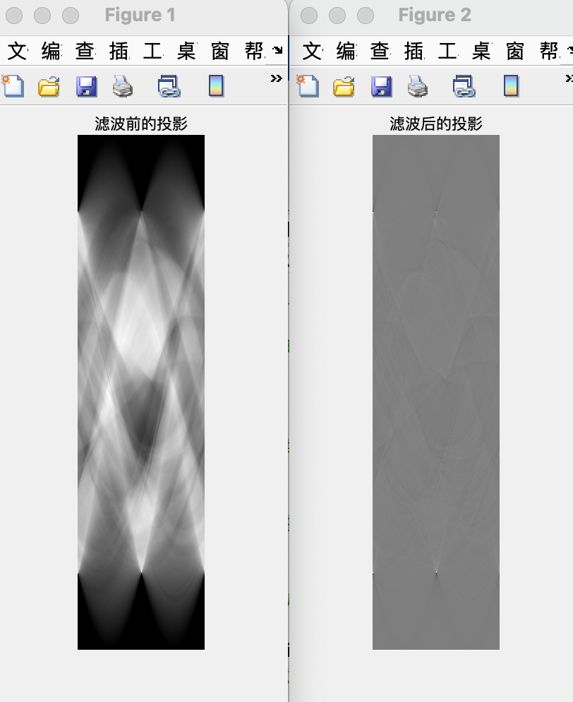</div>

### **Step4：**将所有处理后的结果叠加，最终得到原图像。

```matlab
% ==== step4:将所有处理后的结果叠加，最终得到原图像。 ==== %
result = iradon(g_filtered, theta, 'none'); % 不使用iradon自带的滤波器，直接反投影
imshow(result, []), title("FBP result");
```

查看效果：

<div align="center">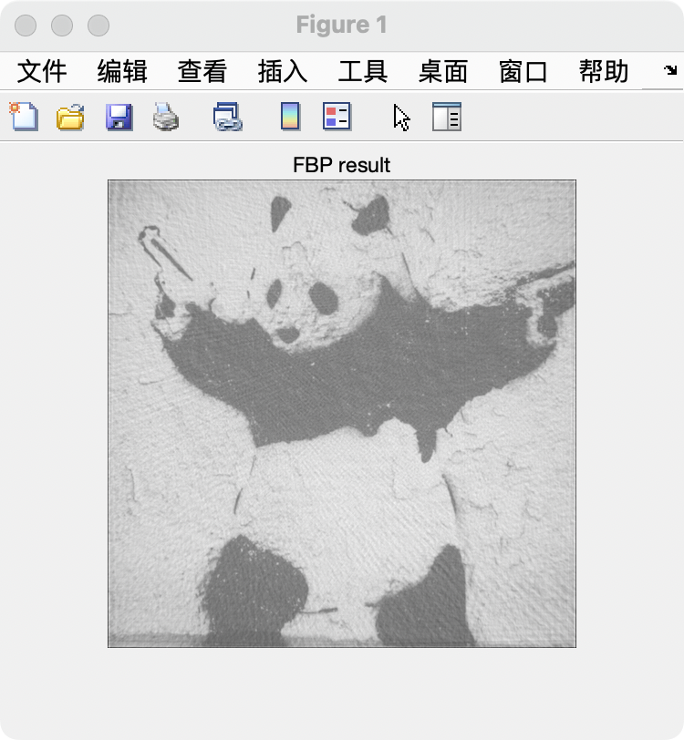</div>

做两个对照组，发现效果远远优于直接反投影法，而与iradon自带滤波的效果相近：

```matlab
% 参照1:直接反投影，无滤波
figure, imshow(iradon(g, theta, 'none'), []), title("参照1: 直接反投影，无滤波");
% 参照2:iradon自带"Ram-Lak"滤波
figure, imshow(iradon(g, theta, 'Ram-Lak'), []), title("参照2: iradon自带Ram-Lak滤波");
```

<div align="center">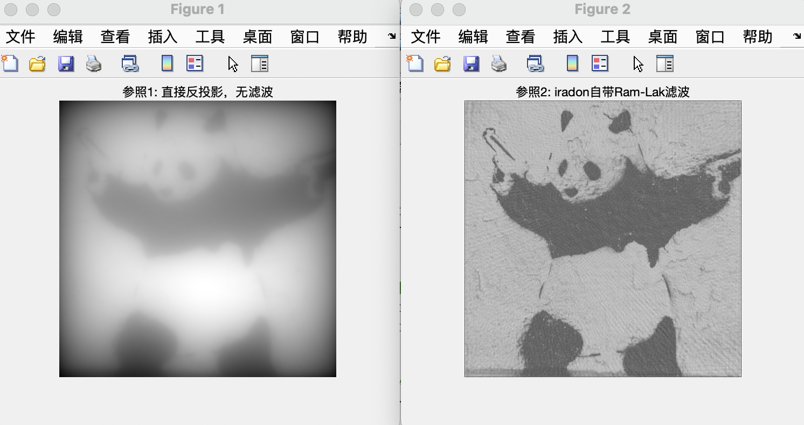</div>

## 七、完整代码

```matlab
clc;
clear;
close all;

% ==== step1:计算每个投影g(p,theta)的一维傅里叶变换G(w,theta) ==== %
I = imread("panda.png");
I = rgb2gray(I);    % 转为灰度图片

theta = 0:179;
g = radon(I,theta);   % 做0~179度共计180个角度的投影，得到g(p,theta)
width = length(g); 

G = fft(g,729);   % 一维快速傅里叶变换，得到G(w,theta)。注意：该结果为复数


% ==== step2:将G(w,theta)乘以斜坡滤波器|w| ==== %
% 这里采用Ram-Lak滤波器
filter = 2*[0:round(width/2-1), width/2:-1:1]' / width;
G_filtered = G .* filter;     % 滤波：用一维傅里叶变换结果点乘filter


% ==== step3:对step2的结果做一维傅里叶逆变换 ==== %
g_filtered = ifft(G_filtered);
g_filtered = real(g_filtered);  % 取实部


% ==== step4:将所有处理后的结果叠加，最终得到原图像。 ==== %
result = iradon(g_filtered, theta, 'none'); % 不使用iradon自带的滤波器，直接反投影
imshow(result, []), title("FBP result");


% 参照1:直接反投影，无滤波
figure; imshow(iradon(g, theta, 'none'), []), title("参照1: 直接反投影，无滤波");
% 参照2:iradon自带"Ram-Lak"滤波
figure; imshow(iradon(g, theta, 'Ram-Lak'), []), title("参照2: iradon自带Ram-Lak滤波"); 

```


