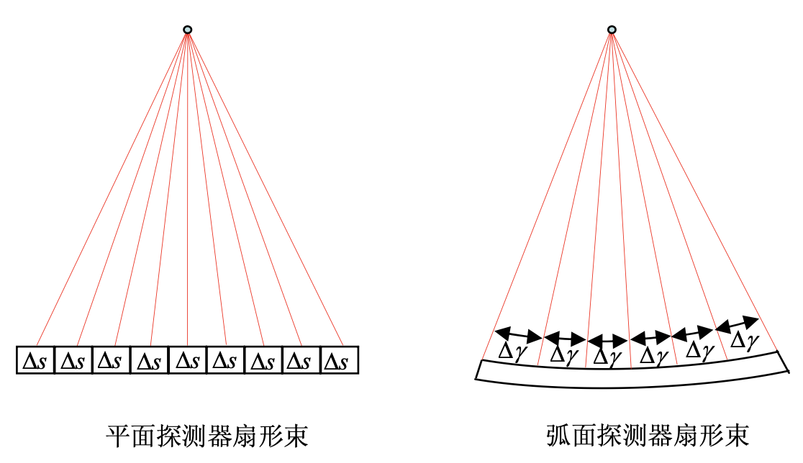
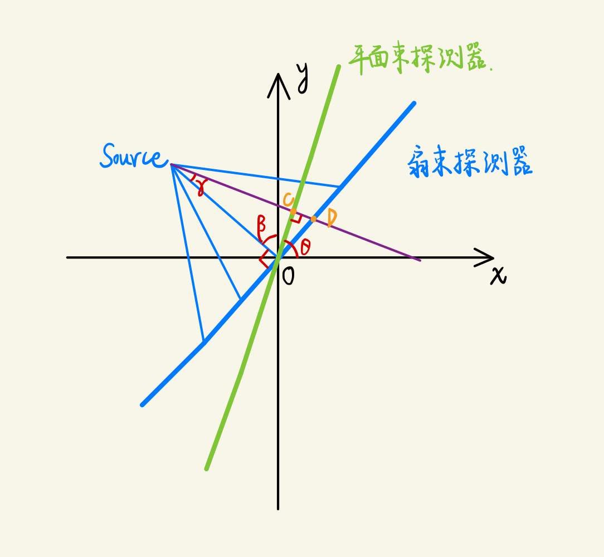
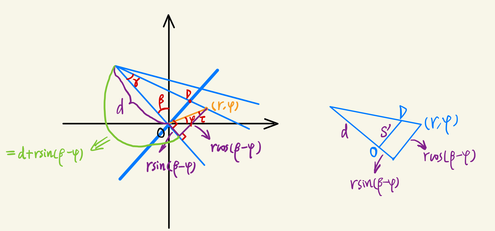
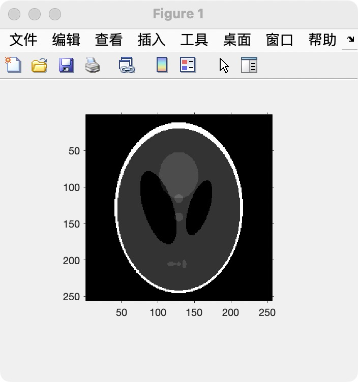
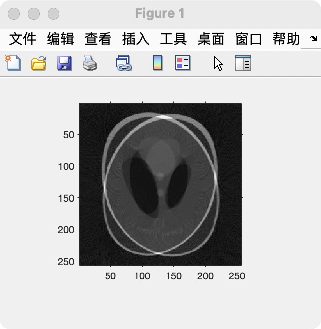
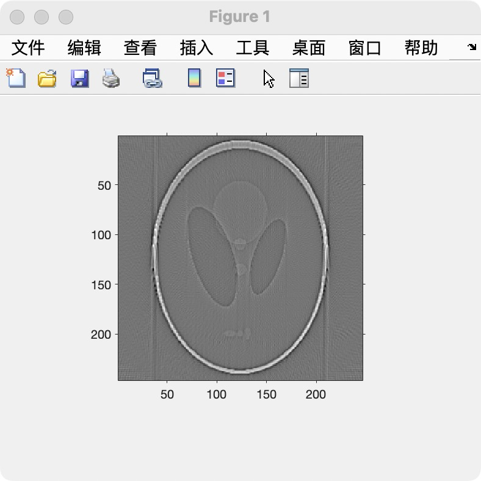

### 一、扇形束重建理论与公式推导

#### 1、扇形束的基本知识

​	根据探测器的不同，可以将扇形束分为**平面探测器（等距）**和**弧面探测器（等角）**两种。目前实验室采用平面探测器，本次实验也将围绕平面探测器展开。

<div align="center"></div>

#### 2、扇形束重建理论推导

平行束重建中，图像的时域表达式为： 
$$
\begin{aligned}
f(x,y)&=\frac{1}{2}\int^{2\pi}_{0}P_\theta(t)*h(t)d\theta \\
&=\frac{1}{2}\int_{0}^{2\pi}\int_{-\infty}^{\infty}P_\theta(t)h(t_0-t)dtd\theta （卷积展开）\\
&=\frac{1}{2}\int_{0}^{2\pi}\int_{-\infty}^{\infty}P_\theta(t)h(x\cos \theta + y \sin \theta-t)dtd\theta （令t_0=x\cos \theta + y \sin \theta）\\
&转为极坐标：令 x=r\cos\phi,y=r\sin \phi \\
f(r,\phi)&=\frac{1}{2}\int_{0}^{2\pi}\int_{-\infty}^{\infty}P_\theta(t)h[r\cos(\theta-\phi)-t]dtd\theta
\end{aligned}
$$
此时，考虑下图中紫色的射线。该射线**既是平行束射线**（与平行束探测器交于C点），**也是扇形束射线**（与扇形束探测器交于D点）。设$OC=t, OD=s,O-Source=d$，则有下列关系：
$$
P(\beta, \gamma)=P(\theta,t)=紫色射线\\
\theta = \beta+\gamma \\
t = s\cos\gamma
$$


这样就建立了平行束与扇形束的初步关系——**共用射线**。下面就可以在扇形束中进行研究。	

由于本次实验使用了**等距**扇形束，角 $\gamma$ 的值不固定，故不能在表达式中使用 $\gamma$。这里我们使用 $s$ 来表示 $\gamma$ ： $\gamma = \arctan{\frac{OD}{O-Source}}=\arctan{\frac{s}{d}}$。

​	此时，有**变量代换**：
$$
\begin{cases}
\theta = \beta + \arctan{\frac{s}{d}}\\
t = \frac{sd}{\sqrt{s^2+d^2}}
\end{cases}
$$
将该变量代换代入 $f(r,\phi)$ 中，有：
$$
f(r,\phi)=\frac{1}{2}\int_{-\arctan{\frac{s}{d}}}^{2\pi-\arctan{\frac{s}{d}}}\int_{-s_m}^{s_m}P_{\beta+\arctan{\frac{s}{d}}}(\frac{sd}{\sqrt{s^2+d^2}})h[r\cos(\beta+\arctan{\frac{s}{d}}-\phi)-\frac{sd}{\sqrt{s^2+d^2}}]\cdot\frac{d^3}{(s^2+d^2)^{\frac{3}{2}}}d\beta ds
$$

> 换元时使用雅可比行列式计算


​	下面进一步化简 $f(r,\phi)$ 的表达式：由于投影角度的旋转可以视为**周期函数**，故外层积分可以替换为 $\int_{0}^{2\pi}$ ，又因为 $P(\beta, \gamma)=P(\theta,t)=紫色射线$ ，所以可令 $P_{\beta+\arctan{\frac{s}{d}}}(\frac{sd}{\sqrt{s^2+d^2}}) = R_\beta(s)$。此时，原式为：
$$
f(r,\phi)=\frac{1}{2}\int_{0}^{2\pi}\int_{-s_m}^{s_m}R_\beta(s)\frac{d^3}{(s^2+d^2)^{\frac{3}{2}}}h[r\cos(\beta+\arctan{\frac{s}{d}}-\phi)-\frac{sd}{\sqrt{s^2+d^2}}]d\beta ds
$$
​	

现在关注**函数h**内部的变量。因为 
$$
\begin{aligned}
&r\cos(\beta+\arctan{\frac{s}{d}}-\phi)-\frac{sd}{\sqrt{s^2+d^2}}\\
&= r \cos(\beta-\phi)\cos(\arctan{\frac{s}{d}})-r\sin(\beta-\phi)\sin(\arctan\frac{s}{d})-\frac{sd}{\sqrt{s^2+d^2}}\\
&=r\cos(\beta-\phi)\frac{d}{\sqrt{s^2+d^2}}-[r\sin(\beta-\phi)+d]\frac{d}{\sqrt{s^2+d^2}}
\end{aligned}
$$
现在考虑 $r\cos(\beta-\phi)$ 和 $r\sin(\beta-\phi)+d$ 的含义。由下图中**相似三角形**，我们可以设 $OD=s'$，则此时有：
$$
\frac{r\sin(\beta -\phi)+d}{d}=\frac{r\cos(\beta-\phi)}{s'}
$$

<div align="center"></div>	

因此，我们可以设 $u=\frac{r\sin(\beta -\phi)+d}{d}=\frac{r\cos(\beta-\phi)}{s'}$ ，则此时有：
$$
r\cos(\beta+\arctan{\frac{s}{d}}-\phi)-\frac{sd}{\sqrt{s^2+d^2}}=\frac{ud}{\sqrt{s^2+d^2}}(s'-s)
$$
故图像表达式进一步简化为：
$$
f(r,\phi)=\frac{1}{2}\int_{0}^{2\pi}\int_{-s_m}^{s_m}R_\beta(s)\frac{d^3}{(s^2+d^2)^{\frac{3}{2}}}h[\frac{ud}{\sqrt{s^2+d^2}}(s'-s)]d\beta ds
$$
因为 $h(s)$ 的傅立叶变换为 $|\omega|$， 故 $h[\frac{ud}{\sqrt{s^2+d^2}}(s'-s)]=\int|\omega|e^{j2\pi\omega\frac{ud}{\sqrt{s^2+d^2}}(s'-s)}d\omega$。现在换元，令 $\omega'=\omega\frac{ud}{\sqrt{s^2+d^2}}$，则有：
$$
\begin{aligned}
h[\frac{ud}{\sqrt{s^2+d^2}}(s'-s)]&=\int |\omega'\frac{\sqrt{s^2+d^2}}{ud}|e^{j2\pi\omega'(s'-s)}\frac{\sqrt{s^2+d^2}}{ud}d\omega'\\
&=\frac{s^2+d^2}{u^2d^2}\int|\omega'|e^{j2\pi \omega'(s'-s)}d\omega'\\
&=\frac{s^2+d^2}{u^2d^2}h(s'-s)
\end{aligned}
$$
所以，图像表达式可以化到最简形式：
$$
f(r,\phi)=\frac{1}{2}\int_{0}^{2\pi}\frac{1}{u^2}\int_{-s_m}^{s_m}R_{\beta}(s)\frac{d}{\sqrt{s^2+d^2}}h(s'-s)dsd\beta
$$


### 二、扇形束重建实验思路

#### 1、完整思路

step1：投影。扇形束投影，收集探测器上的投影数据F

step2：加权。对投影数据F 乘以 $\frac{d}{\sqrt{s^2+d^2}}$ 进行加权。

step3：卷积滤波。

step4：反投影。

#### 2、反投影思路

反投影时，对于某个角度下的某个点(x,y)，只需要计算出其对应的 $s'$，就能知道它在当前角度下的探测器的序号，从而获得它的投影索引。取出该投影值后，直接加到该像素上即可（离散的积分就是求和）。


### 三、代码实现

#### 1、 实验代码

```matlab
clear;
clc;

I = phantom(256);   % 获得脑部影像
beta = 0:1:359;     % 探测器的旋转角
 

% === step1:获得扇束投影 === %
[m,n] = size(I);
% 该距离d应该改为 d>=16
d = 2*m;    % 射线源与旋转中心之间的距离
[F, detector, angle] = fanbeam(I, d, 'FanSensorGeometry', 'line');


% === step2:滤波前加权weight1 === %
detector_num = length(detector);    % 记录探测器的数量    
tensor_d = ones(detector_num,1).*d;   % 将d扩展为列向量，方便运算
weight1 = tensor_d ./ (sqrt(tensor_d.*tensor_d + detector.*detector));% 计算权重weight1

% 对投影加权
for i = 1:length(beta)
    F(:,i) = F(:,i) .* weight1;  
end


% === step3:滤波 === %
% 构造滤波器filter
t = linspace(-n/2, n/2-1, n);
filter = 0.0085 * (sinc(t)/2-sinc(t/2).^2/4);

% 调整投影位置,首位垫m行
R = F;
F = zeros(detector_num+2*m, 360);
F(m+1:m+detector_num, :) = R;

% 卷积
for N = 1:360
    temp(:, N) = conv(F(:,N), filter);
end
% 选取中间的有效部分作为卷积结果(m行之前的留白+m/2行的脉冲函数)
F = temp(3*m/2:3*m/2+detector_num, :);

% % 使用ifanbeam检查一下效果, F正常
% I1 = ifanbeam(F,d, 'FanSensorGeometry', 'line');
% imshow(I1, []);


% === step4:加权反投影 === %
I1 = zeros([m,n]);

for b = 0:359
    r = deg2rad(b); % 角度转为弧度,便于使用sin/cos
    % 设当前待重建点坐标为(x,y)
    for y = 1:m
        for x = 1:n
            % 计算s': 相似三角形
            s1 = d * ((x-n/2)*cos(r)+(y-m/2)*sin(r)) / (d+(x-n/2)*sin(r)-(y-m/2)*cos(r));
            % 确保s'未超出探测器范围
            if (s1>=-(detector_num-1)/2) && (s1<=(detector_num-1)/2)
                % 取整,得到该点(亦即s')对应点detector序号
                s1_int = round(s1);     
                % 重建该点
                point = F(s1_int+(detector_num-1)/2+1, b+1);
                % 积分反投影 (离散积分用求和表示): 注意matlab中纵轴的方向
                I1(m-y+1,x) = I1(m-y+1,x) + 1/(2*power(U(d,x-m/2,y-m/2,r),2)) * point;
            end
        end
    end
end    


imshow(I1,[]);


% === func:计算公式中的 u === %
function u = U(d,x,y,beta)
    u = (d+x*sin(beta)-y*cos(beta)) / d;
end

```


#### 2、原图

<div align="center"></div>

#### 3、重建结果

​	检查了好几遍都没找到错误所在...


<div align="center"></div>


### 四、缺陷与反思

#### 1、重建结果有误差

按步骤进行了实验，但是最后的结果还是有误差。

在投影F 卷积滤波之后，我用matlab自带的ifanbeam进行了测试，测试的结果比较正常（如下图所示）。感觉应该是反投影部分出现了问题，但是检查了好几遍还是没看出来.......

<div align="center"></div>

#### 2、基础知识有待夯实

数学和数字图像处理方面的基础知识有待夯实。

这次实验中用到的卷积，不是很熟悉，查阅了不少资料才粗略弄懂。此外，由于之前一直在看《机器学习》，还没有来得及看冈萨雷斯的那本《数字图像处理》，导致有一些基础知识（诸如傅立叶变换、时域/频域）虽然能勉强使用，但是理解尚不通透。


### 补充-2022.07.24-debug成功

bug在于射线源与旋转中心之间的距离distance过短，当`d >= 16` 时，重建效果基本完善。详情可见**周报2022.07.18~07.24**。

