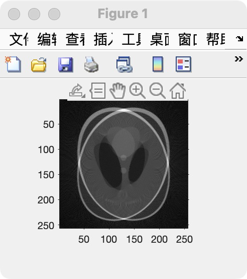
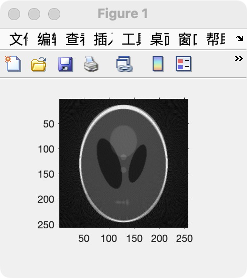
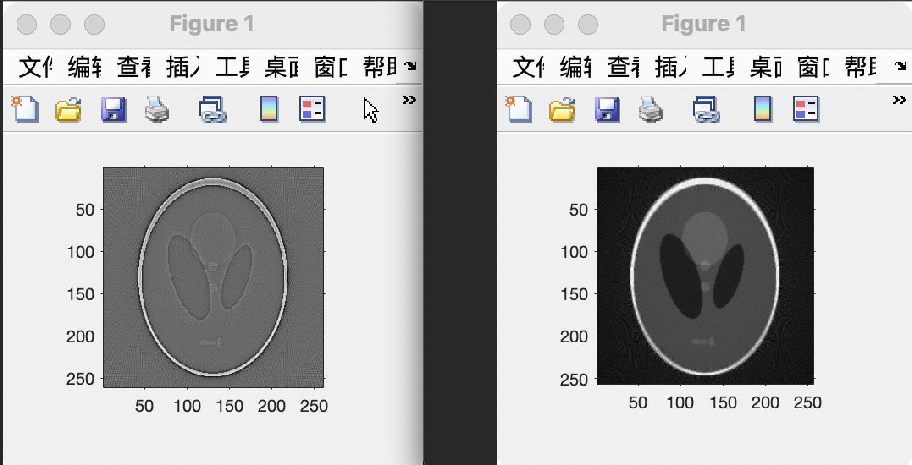

### 一、本周进度

1. 修改了扇形束重建的代码，成功生成了原图；
2. 按照导师建议，实现了傅立叶变换和频域乘积滤波的方法；
3. 学习了锥形束重建的理论部分（部分完成）。

### 二、扇形束重建的改进

#### 1、存在的问题

扇形束重建实验的问题主要有两个：

1. 重建效果不理想（如下图），存在对称的重影；
2. 滤波部分使用卷积，方法繁琐，有待改善。

<div align="center"></div>

#### 2、扇形束重建bug修正

先按李老师的建议仔细检查了一下**反投影的角度**是否有错，并设置断点，每隔10度测试了一下0～179度的反投影效果。发现反投影的上部和下部都有向左偏移的趋势，因此怀疑我是不是<u>反投影的旋转中心设置错误</u>，但是仔细检查并未发现错误。

<div align="center"></div>

后来又看了0、45、90、135四个角度的反投影，发现一个**共性的问题**：这些单角度的反投影似乎都没有覆盖整张图。由此猜想：或许是因为<font color="red">射线源与旋转中心的距离distance过**近**导致反投影出现了bug</font>。

于是，我先修改distance，令`d = 4 * m`，得到的结果如下：

<div align="center"></div>

对比上面的重建效果，明显两个伪影的重叠度变高了。立即继续增大distance，直到令`d = 16 * m` 时，已经几乎看不出伪影，效果如下：

<div align="center"></div>

后面，无论再怎么放大distance，重建的效果都非常清晰，最大试过 `d = 10000 * m` ，效果仍然非常清晰。

最后，我们选用 `d = 20 * m` ，并使用matlab自带的ifanbeam直接反投影作为一个对照。下图中左边为ifanbeam直接重建的效果，右边为使用自己的方法重建的效果，可以看到有明显的区别：

<div align="center"></div>

至此，扇形束重建debug完毕。

#### 3、滤波方法优化

**理论**：根据==时域的卷积=频域的乘积==原理，可以利用傅立叶变换，在频率域实现对投影F的滤波。

这里其实和平行束重建的滤波部分一样，几乎只需要根据新图像修改一下数据即可，代码如下：

```matlab
% >> 方法二: 频域乘积
% 得到投影F的傅立叶变换f
f = fft(F, detector_num);
% 这里采用Ram-Lak滤波器
filter = 2 * [0:round(detector_num/2-1), detector_num/2:-1:1]' / detector_num;
f_filtered = f .* filter;     % 滤波：用投影结果点乘filter
% 傅里叶逆变换
F = ifft(f_filtered);
F = real(F);  % 取实部
```

使用`tic, toc `测量了一下运行时间，使用频域滤波确实比时域卷积**快上数倍**。


### 三、下周计划

近期由于EDP课程（即蒙纳士的英语课程）有一篇大文章要完成，所以时间略显紧张。

下周计划继续做锥形束重建，把锥形束重建的理论搞懂、实验完成；如果学有余力的话，就继续啃《机器学习（周志华）》和《数字图像处理（冈萨雷斯）》。

