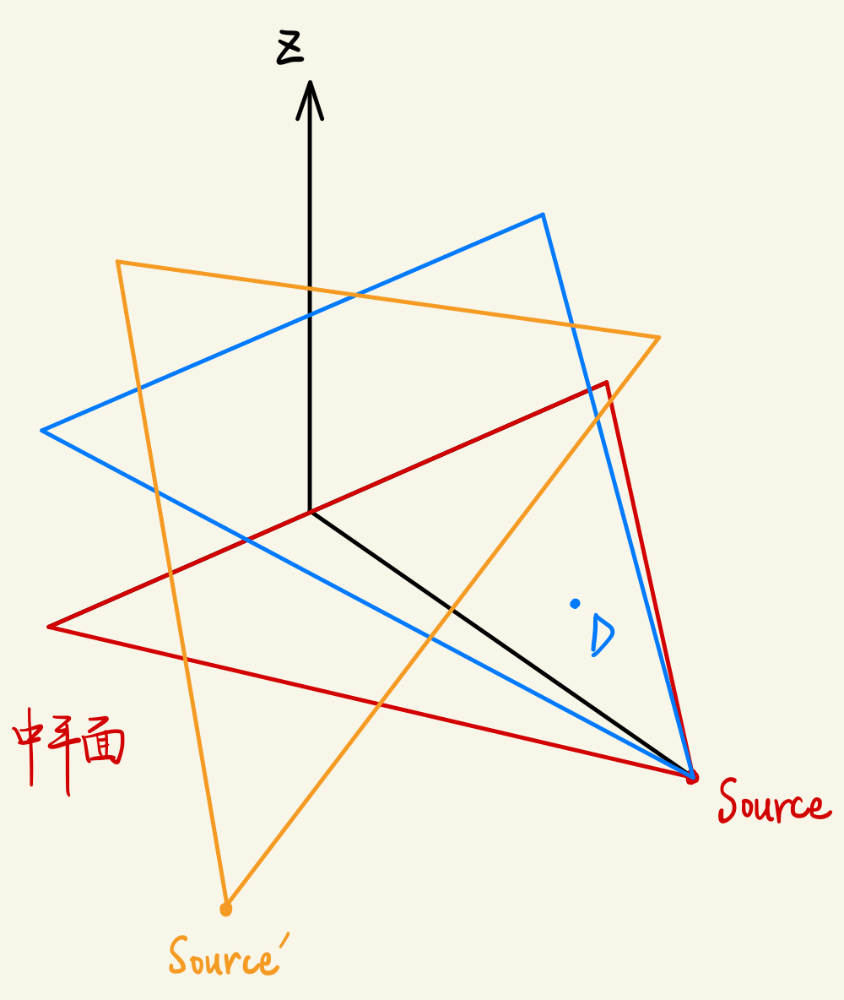
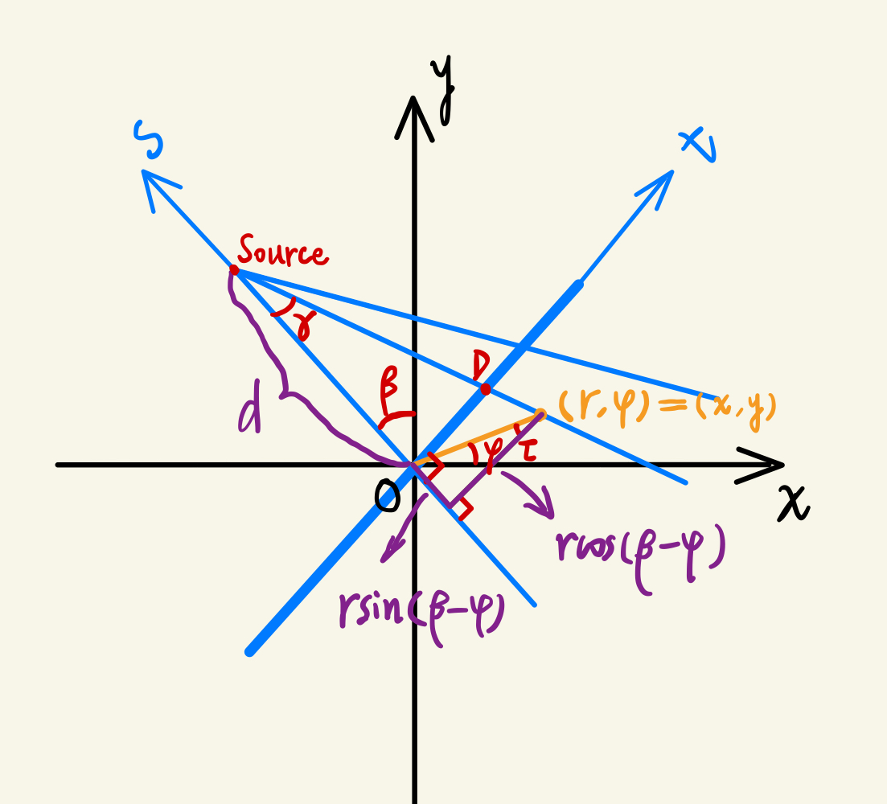
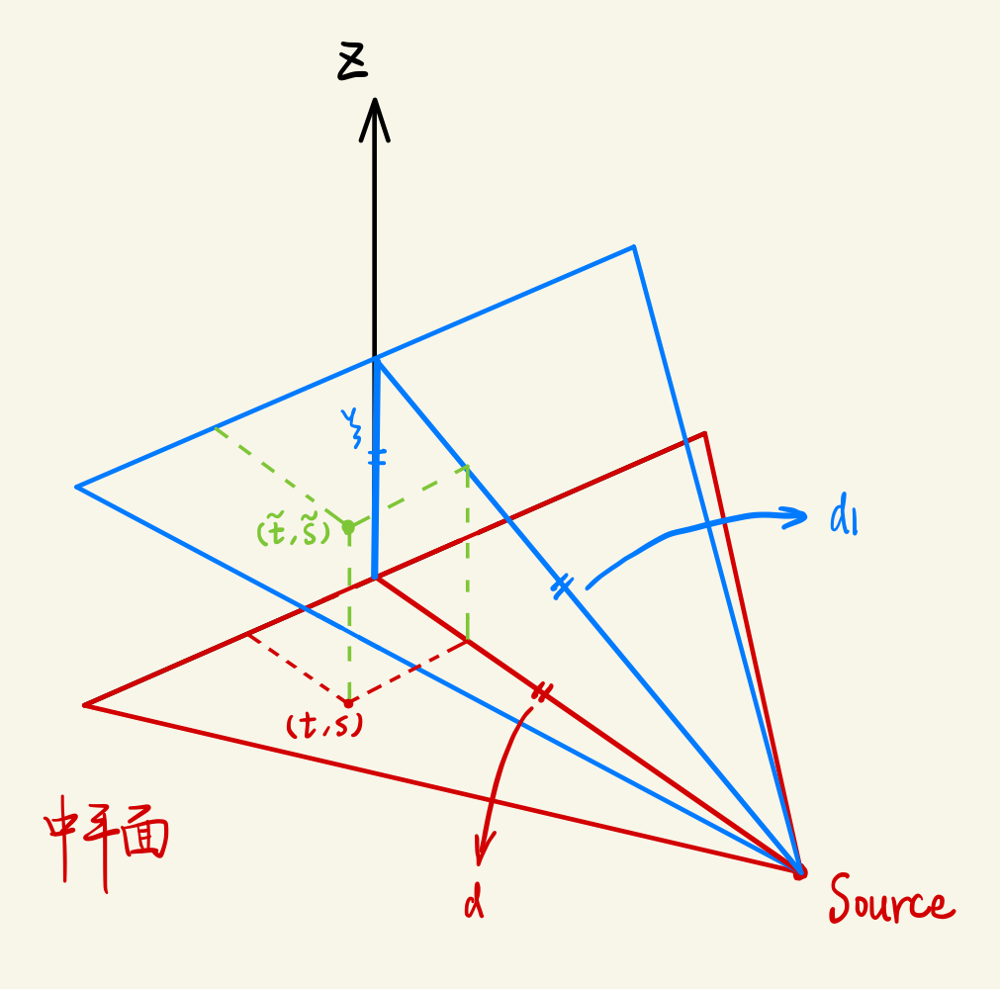
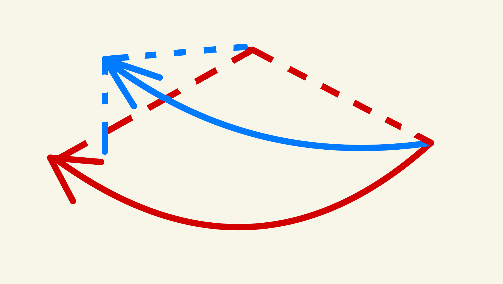
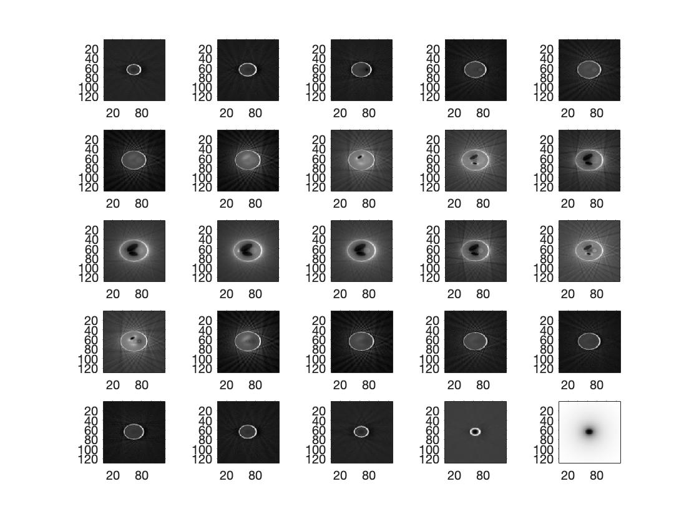

**核心**：FDK(Fieldkamp-Davis-Kress)算法

### 一、扇束重建vs锥束重建

#### 1、重建精度

- **扇束FBP**：<font color="red">精确</font>重建算法——没有近似，重建过程符合严谨的理论推导；使用线阵探测器。

- **锥束FDK**：<font color="red">近似</font>重建算法——重建过程需要近似；使用面探测器。

#### 2、点的重建

- **扇束**：二维图像上的任意一点（下图中的“中平面”），对于任意一个旋转角 $\beta$ ，都在同一个投影平面内。
- **锥束**：三维物体内，斜面上的点（即中平面之外的点，如下图中点D），当旋转角 $\beta$ 发生变化，可能就不在之前的投影平面内了。

<div align="center"></div>

 #### 3、FDK算法的缺陷

由于锥束重建中，斜面上的点的重建并不难很好的适应扇束重建理论，因此：

- 斜面与中平面夹角较**小**：投影轨迹可近似为圆形轨迹，重建过程也可以近似的套用扇束重建的过程
- 斜面与中平面夹角较**大**：重建效果将比较差。这也是FDK算法的缺陷。


### 二、FDK算法理论推导

由扇束重建的公式：
$$
g(r,\phi)=\frac{1}{2}\int_{0}^{2\pi}\frac{1}{u^2}\int^{p_m}_{-p_m}R_\beta (p)\frac{d}{\sqrt{d^2+p^2}}h(p'-p)dpd\beta
$$

> $p'=\frac{dr\cos(\beta-\phi)}{d+r\sin(\beta-\phi)}$ ：待重建点在探测器上的位置（即原 $s'$）
>
> $h\rightarrow fft \rightarrow |\omega|$
>
> $u = \frac{d+r\sin(\beta-\phi)}{d}$

#### 1、重新建系

做如下坐标变换：
$$
令
\begin{bmatrix}t\\s\end{bmatrix}=\begin{bmatrix}\cos\beta&\sin\beta\\-\sin\beta&\cos\beta\end{bmatrix}=\begin{bmatrix}x\\y\end{bmatrix}=\begin{bmatrix}\cos\beta x+\sin\beta y\\-\sin\beta+\cos\beta y\end{bmatrix}
$$
因为$x=r\cos\phi,y=r\sin\phi$，故有：
$$
\begin{cases}
t=r\cos(\beta-\phi)\\
s=-r\sin(\beta-\phi)
\end{cases}
$$
此时，新坐标 $(t,s)$ 的几何意义如下：

<div align="center"></div>

故扇束重建公式可化简为：
$$
\begin{aligned}
g(r,\phi)&=\frac{1}{2}\int_{0}^{2\pi}\frac{1}{u^2}\int^{p_m}_{-p_m}R_\beta (p)\frac{d}{\sqrt{d^2+p^2}}h(p'-p)dpd\beta\\
&=\frac{1}{2}\int_{0}^{2\pi}\frac{d^2}{[d+r\sin(\beta-\phi)]^2}\int^{p_m}_{-p_m}R_\beta (p)\frac{d}{\sqrt{d^2+p^2}}h(\frac{dr\cos(\beta-\phi)}{d+r\sin(\beta-\phi)}-p)dpd\beta\\
g(t,s)&=\frac{1}{2}\int_{0}^{2\pi}\frac{d^2}{(d-s)^2}\int^{p_m}_{-p_m}R_\beta (p)\frac{d}{\sqrt{d^2+p^2}}h(\frac{dt}{d-s}-p)dpd\beta
\end{aligned}
$$

#### 2、建立扇束重建和锥束重建的关系

<div align="center"></div>

如上图，有 $d'^2=d^2+\xi^2$，点 $(t,s)$ 是点 $(\tilde{t},\tilde{s})$ 在中平面上点投影。

- 对于中平面上的点 $(t,s)$，显然符合扇束重建理论，有：
  $$
  g(t,s)=\frac{1}{2}\int_{0}^{2\pi}\frac{d^2}{(d-s)^2}\int^{p_m}_{-p_m}R_\beta (p)\frac{d}{\sqrt{d^2+p^2}}h(\frac{dt}{d-s}-p)dpd\beta ............(1)
  $$

- 对于斜面上的点 $(\tilde{t},\tilde{s})$，则有：
  $$
  g(\tilde{t},\tilde{s})=\frac{1}{2}\int_{0}^{2\pi}\frac{d_1^2}{(d_1-\tilde{s})^2}\int^{p_m}_{-p_m}R_\beta (p)\frac{d_1}{\sqrt{d_1^2+p^2}}h(\frac{d_1\tilde{t}}{d_1-\tilde{s}}-p)dpd\beta_1............(2)
  $$

上述两个表达式中，投影旋转角的微分有区别，$(1)$式中的$d\beta$在中平面内变化，而$(2)$式中的$d\beta_1$则是斜向上变化的，如图所示：

<div align="center"></div>

因此，有：
$$
d\cdot d\beta=d_1\cdot d\beta_1=弧长的微元
$$
故 $(2)$式中有如下关系：
$$
\begin{cases}
d\beta_1=\frac{d}{d_1}d\beta\\
\tilde{t} = t\\
\tilde{s} = \frac{d_1}{d}s\\
\frac{1}{u^2}=\frac{d^2}{(d-s)^2}\\
\frac{d_1\tilde{t}}{d_1-s}=\frac{dt}{d-s}
\end{cases}
$$
代入 $(2)$ 式，进一步化简：
$$
\begin{aligned}
g(\tilde{t},\tilde{s})&=\frac{1}{2}\int_{0}^{2\pi}\frac{d^2}{(d-s)^2}\int^{p_m}_{-p_m}R_\beta (p)\frac{d_1}{\sqrt{d_1^2+p^2}}\frac{d}{d_1}h(\frac{dt}{d-s}-p)dpd\beta\\
&=\frac{1}{2}\int_{0}^{2\pi}\frac{d^2}{(d-s)^2}\int^{p_m}_{-p_m}R_\beta (p,\xi)\frac{d}{\sqrt{d^2+\xi^2+p^2}}h(\frac{dt}{d-s}-p)dpd\beta
\end{aligned}
$$
因此，扇束重建与锥束重建的联系主要有如下三点：

1. 投影数据有差别：$R_{\beta}(p,0)\rightarrow R_{\beta}(p,\xi)$
2. 加权有差别：$\frac{d}{\sqrt{d^2+p^2}}\rightarrow \frac{d}{\sqrt{d^2+\xi^2+p^2}}$
3. 滤波不变：傅立叶变换后，都是乘以斜坡滤波器 $|\omega|$

#### 3、锥束的并行化操作

在多线程环境下，可以先分别算不同 $\xi$ 下的滤波结果，再并行的计算反投影。


### 三、FDK算法实现步骤

Step1: 获得三维物体的投影数据，得到一个三维数组。

> <font color="red">第一步没有思路，直接借鉴了网上现成的投影代码</font>

Step2: 滤波。

Step3: 反投影。


### 四、锥形束重建（FDK算法）代码实现

```matlab
clear;
clc;

% === step1: 投影 === %
n = 128; % 探测器数
d = 10000; % 源到旋转中心的距离
SDD = 2 * d; % 源到探测器中心的距离
vitual_detector_length = 2; % 虚拟探测器长度
detector_length = vitual_detector_length * SDD / d;   % 实际探测器长度（相似三角）
beta = 0:1:359;
beta_num = length(beta); % 旋转角度数
detector_channel_size = detector_length / n; % 探测器的单位长度

P = zeros(n, n, beta_num); % 存放投影数据
% 定义shepp-logan模型参数 
% xe     ye     ze     ae     be     ce     phi    gamma    theta     rho
shep = [
  0      0      0  0.6900  0.9200 0.8100    0       0        0     1.0000
  0  -0.0184    0  0.6624  0.8740 0.7800    0       0        0    -0.8000
  0.2200 0      0  0.1100  0.3100 0.2200  -18.0000  0     10.0000 -0.2000
 -0.2200 0      0  0.1600  0.4100 0.2800   18.0000  0     10.0000 -0.2000
  0  0.3500 -0.1500 0.2100 0.2500 0.4100    0       0        0     0.1000
  0  0.1000 0.2500 0.0460  0.0460 0.0500    0       0        0     0.1000
  0 -0.1000 0.2500 0.0460  0.0460 0.0500    0       0        0     0.1000
-0.0800 -0.6050 0  0.0460  0.0230 0.0500    0       0        0     0.1000
  0 -0.6060     0  0.0230  0.0230 0.0200    0       0        0     0.1000
0.0600 -0.6050  0  0.0230  0.0460 0.0200    0       0        0     0.1000];

% 生成投影数据P
P = medfunc3DProjectHeadModel(shep, n, d, detector_channel_size, beta_num);
P = permute(P,[2,1,3]);
% % 检查投影效果
% for i = 1:10:360
%     figure;
%     imshow(P(:,:,i),[]);
% end


% === step2: 加权,滤波 === %
detector = -63:64;   % 探测器的实际位置
detector = detector';
temp = zeros(n, n, beta_num);  % 用于暂存滤波结果
% xi = ξ, 锥束投影中距中平面的距离
for xi = detector
    tensor_d = ones(n,1) .* d;
    tensor_xi = ones(n,1) .* xi;
    weight = tensor_d ./ (sqrt(tensor_d.*tensor_d + detector.*detector + tensor_xi.*tensor_xi));

    % 对投影加权
    for i = 1:beta_num
        P(:,xi+n/2,i) = P(:,xi+n/2,i) .* weight;
    end

    % 滤波: 频域乘积|w|
    % 得到投影F的傅立叶变换f
    f = fft(P(:,xi+n/2,:), n);
    % 这里采用Ram-Lak滤波器
    filter = 2 * [0:round(n/2-1), n/2:-1:1]' / n;
    f_filtered = f .* filter;     % 滤波：用投影结果点乘filter
    % 傅里叶逆变换
    temp(:,xi+n/2,:) = ifft(f_filtered);
end

P = real(temp);  % 取实部

% % 检查滤波效果, 正常
% for i = 1:10:360
%     figure;
%     imshow(P(:,:,i),[]);
% end


% === step3: 反投影 === %
I = zeros([n,n,n]);
for b = beta
    r = deg2rad(b); % 角度转为弧度,便于使用sin/cos
    % 设当前待重建点坐标为(x,y,z)
    for y = 1:n     
        for x = 1:n
            for z = 1:n     % 对于任意ξ, 系数d^2/(d-s)^2都相同
                s = -(x-n/2)*sin(r) + (y-n/2)*cos(r);
                t1 = d * ((x-n/2)*cos(r)+(y-n/2)*sin(r)) / (d+(x-n/2)*sin(r)-(y-n/2)*cos(r));    % 即原来的s'
                % 确保t1未超出探测器范围
                if (t1>-n/2) && (t1<=n/2)
                    % 取整,得到该点对应点detector序号
                    t1_int = ceil(t1);     
                    % 重建该点
                    point = P(z, t1_int+n/2, b+1);
                    % 积分反投影 (离散积分用求和表示): 注意matlab中纵轴的方向
                    I(x, y, z) = I(x, y, z) + d*d / (2*power((d-s),2)) * point;
                end
            end
        end
    end
end


% 借鉴别人的投影方法
function P = medfunc3DProjectHeadModel(shep, N, SOD, detector_channel_size, theta_num)
    % Function of Projecting Of S_L Head Model
    %------------------------------------------
    %Input parameters as follow
    %shep:仿真头模型参数矩阵
    %N:探测器通道个数
    %SOD:源到旋转中心的距离
    %detector_channel_size:探测器的像素（通道）大小
    %theta_num:总的不同角度的投影次数
    %------------------------------------------
    %Output parameters as follow
    %P:投影数据矩阵N * N * 总的投影角度数
    %===================================================%
    P = zeros(N, N, theta_num);
    xe = shep(:,1)';
    ye = shep(:,2)';
    ze = shep(:,3)';
    ae = shep(:,4)';
    be = shep(:,5)';
    ce = shep(:,6)';
    phi = shep(:,7)';
    gamma = shep(:,8)';
    theta = shep(:,9)';
    rho = shep(:,10)';
    for m = 1:theta_num
        totation_theta = (m-1) * pi / 180;%旋转角度转成弧度
        for k1 = 1:N
            for k2 = 1:N
                Ax = (k1 - N/2)*detector_channel_size * cos(totation_theta) + SOD * sin(totation_theta);
                Ay = (k1 - N/2)*detector_channel_size * sin(totation_theta) - SOD * cos(totation_theta);
                Az = (k2 - N/2)*detector_channel_size;
                Bx = -(SOD * sin(totation_theta));
                By = (SOD * cos(totation_theta));
                Bz = 0;
                asq = ae.^2;
                bsq = be.^2;
                csq = ce.^2;
                phi_rad = phi * pi / 180;
                gamma_rad = gamma * pi / 180;
                theta_rad = theta * pi / 180;
                cos_phi = cos(phi_rad);sin_phi = sin(phi_rad);
                cos_gamma = cos(gamma_rad);sin_gamma = sin(gamma_rad);
                cos_theta = cos(theta_rad);sin_theta = sin(theta_rad);
                %%%%%%%%%%%%%%%%%%%%%%%%计算旋转矩阵%%%%%%%%%%%%%%%%%%%%%%%%%
                % T = [ T11 T12 T13
                %       T21 T22 T23
                %       T31 T32 T33];
                T11 = cos_theta .* cos_phi - cos_gamma .* sin_phi .* sin_theta;
                T12 = cos_theta .* sin_phi + cos_gamma .* cos_phi .* sin_theta;
                T13 = sin_theta .* sin_gamma;
                T21 = -sin_theta .* cos_phi - cos_gamma .* sin_phi .* cos_theta;
                T22 = -sin_theta .* sin_phi + cos_gamma .* cos_phi .* cos_theta;
                T23 = cos_theta .* sin_gamma;
                T31 = sin_gamma .* sin_phi;
                T32 = -sin_gamma .* cos_phi;
                T33 = cos_gamma;
                A1 = Ax * T11 + Ay * T12 + Az * T13;
                A2 = Ax * T21 + Ay * T22 + Az * T23;
                A3 = Ax * T31 + Ay * T32 + Az * T33;
                B1 = Bx * T11 + By * T12 + Bz * T13 - xe;
                B2 = Bx * T21 + By * T22 + Bz * T23 - ye;
                B3 = Bx * T31 + By * T32 + Bz * T33 - ze;
                A = bsq.*csq.* A1.^2 + asq.*csq.*A2.^2 + asq.*bsq.*A3.^2;
                B = 2 * (bsq.*csq.*A1.*B1 + asq.*csq.*A2.*B2 + asq.*bsq.*A3.*B3);
                C = bsq.*csq.*B1.^2 + asq.*csq.*B2.^2 + asq.*bsq.*B3.^2 - asq.*bsq.*csq;
                delta = B.^2 - 4 * A.* C;
                ind = delta>=0;
                temp = sqrt(delta .* ind * (Ax^2 + Ay^2 + Az^2))./A;
                tmp = sum(rho .* temp);
                P(k1,k2,m) = P(k1,k2,m) + tmp;
            end
        end
    end
end
```

### 五、实验效果

`imshow`了不同 $z$ 值的重建结果，可以看出效果还是比较理想的。

<div align="center"></div>


### 六、总结

在投影部分（即：<font color="red">获取三维的shepp-logan图像，并对其进行锥束投影</font>）卡了很久，自己实现锥束投影比较无从下手，最后直接用了论坛上找到的投影代码获取投影。

后续的重建部分比较简单，与扇束十分类似。只需要搞清楚 $(\tilde{t},\tilde{s})$ 和 $(t,s)$ 之间的关系，就能比较轻松的重建出来。